# EX DockerCon Demo

In these demos you will deploy an application on Universal Control Plane (UCP) that takes advantage of some of the latest features of Docker Datacenter. The tutorial will lead you through building a compose file that can deploy a full application on UCP in one click.

Then, you will build an example application from a Dockerfile and push your image to the Docker Trusted Registry (DTR). DTR will scan your image for vulnerabilities so they can be fixed before your application is deployed. This helps you build more secure apps!

> **Tasks**:
>
> * [EX Booth Setup](#setup)
> * [Credits](#credits)
> * [Task 1: Deploying a Simple Application with Universal Control Plane](#task1)
>   * [Task 1.1: Deploy with Compose](#task1.1)
>   * [Task 1.2: Scaling Services](#task1.2)
>   * [Task 1.3: Deploying the Visualizer App](#task1.3)
> * [Task 2: Deploying a Multi-Service Application with Secrets](#task2)
>   * [Task 2.1: Deploying a Stateful Service](#task2.1)
>   * [Task 2.2: Configuring Application Secrets](#task2.2)
>   * [Task 2.3: Upgrading with a Rolling Update](#task2.3)
> * [Task 3: Securing Applications with DTR](#task3)
>   * [Task 3.1: Example Application](#task3.1)
>   * [Task 3.2: Build the Application Image](#task3.2)
>   * [Task 3.3: Creating a Repo](#task3.3)
>   * [Task 3.4: Pushing to the Docker Trusted Registry](#task3.4)
>   * [Task 3.5: Rebuild the Image (Fix, Rebuild, and Scan)](#task3.5)


## <a name="setup"></a>EX Booth Setup

There are two EX DockerCon Demo Pods (aka booth with macbook). Each Pod gets it's own UCP Cluster + DTR (4 node cluster hosted in AWS). All nodes are running 17.03.1-ee-3 on Ubuntu 16.04. Here's what the node layout looks like for Pod #1 (swap pod1 with pod2 for pod2):

| Hostname  | Notes | Hostname |
| ------------- | ------------- | ------------- |
| node1  | Swarm Master UCP 2.1.3  | pod1-ucp.boothdemo.com, pod1-node1.boothdemo.com |
| node2  | Swarm Worker  | pod1-node2.boothdemo.com |
| node3  | Swarm Worker  | pod1-node3.boothdemo.com |
| node4  | Swarm Worker + DTR 2.2.4 | pod1-dtr.boothdemo.com, pod1-node4.boothdemo.com |
 
Here's direct links for accessing UCP + DTR in each Pod.

| Pod #1  | Pod #2 |
| ------------- | ------------- |
| <a href="https://pod1-ucp.boothdemo.com/" target="_blank">Pod #1 - UCP</a>  | <a href="https://pod2-ucp.boothdemo.com/" target="_blank">Pod #2 - UCP</a>  |
| <a href="https://pod1-dtr.boothdemo.com/" target="_blank">Pod #1 - DTR</a>  | <a href="https://pod2-dtr.boothdemo.com/" target="_blank">Pod #2 - DTR</a>  |

You can also visit [http://boothdemo.com/](http://boothdemo.com/) for access to your EX Pod's machines. 

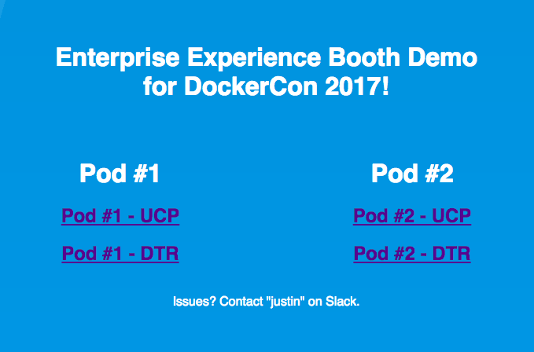 

## <a name="credits"></a>Credits

These examples are based off of Mark Church's [Deploying Applications with Docker EE Advanced / Docker Datacenter](https://github.com/docker/dcus-hol-2017/blob/master/docker-enterprise/README.md) and [Securing Applications with Docker EE Advanced](https://github.com/docker/dcus-hol-2017/blob/master/securing-apps-docker-enterprise/README.md) hands on labs.

## <a name="task1"></a>Task 1: Deploying a Simple Application with Universal Control Plane

In this section we will deploy the [Docker Pets](https://github.com/mark-church/docker-pets) application using a compose file. In the following sections we will add features to our compose file and make our application progressively more complex and feature-full. Docker Pets is a simple web app that records votes for different animals and uses a persistent backend to record the votes. It's comprised of two images:

- **`chrch/docker-pets`** is a front-end Python Flask container that serves up random images of housepets, depending on the given configuration
- **`consul`** is a back-end KV store that stores the number of visits that the web services receive. It's configured to bootstrap itself with 3 replicas so that we have fault tolerant persistence.

This is the first iteration of our compose file for the Docker Pets application:

```
version: '3.1'
services:
    web:
        image: chrch/docker-pets:latest
        ports:
            - 5000
        healthcheck:
            interval: 10s
            timeout: 2s
            retries: 3   
```

- `version: '3.1'` is the version of the compose format we are using.
- `web:` is the name that we are giving this service.
- `image: chrch/docker-pets:1.1` defines the image and version that we are deploying in this service.
- `ports:` configures the ports that we expose for our application. Our application listens on port `5000` so we are exposing port `5000` internally and mapping it to a random ephemeral port externally. UCP will take care of the port mapping and application load balancing for us.
- `healthcheck:` defines the health check for our application. We are setting the `interval` for how often the check runs and how many `timeouts` we allow before we consider the container to be unhealthy.

### <a name="task1.1"></a>Task 1.1: Deploy with Compose

Log in to your UCP GUI and go to Resources / Stacks & Applications / Deploy. Paste the above compose file text into the box under Application Definition. In the Application Name box write `pets`. Click the Create button.

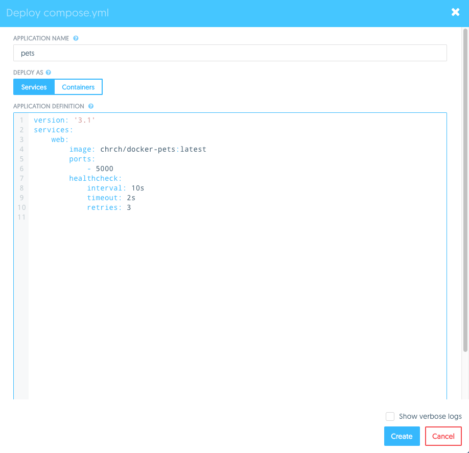 

You should see a success message:

```
Creating network pets_default
Creating service pets_web
```

Your `pets` application stack is now deployed and live! It's running as a single stateless container and serving up a web page. 

Go to Resources and click on the stack that you just deployed. You will see that we deployed a service called `pets_web` and a network called `pets_default`. Click on the `pets_web` service and you will see all of the configured options for this service. Some of these are taken from our compose file and some are default options.

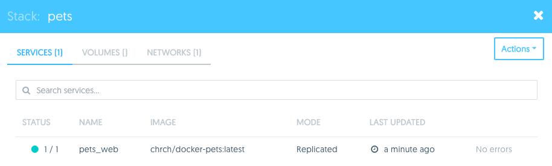 

Go to Resources / Networks and you will see that a new overlay network called `pets_default` now exists.

On the bottom of the `pets_web` page, UCP will show what ports it is exposing the application on. In your browser go to the public IP of one of your worker nodes and the port that is listed `<public-ip>:<published-port>`.

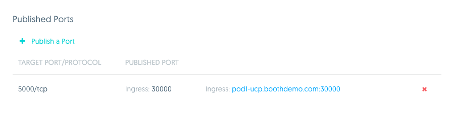 

In your browser you should now see the deployed Docker Pets app. It serves up an image of different pets. Click on "Serve Another Pet" and it will reload the picture.

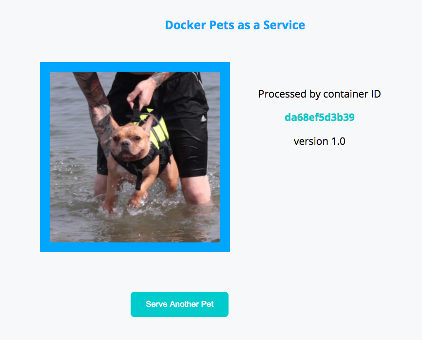 

### <a name="task1.2"></a>Task 1.2: Scaling Services

So far we have deployed a service as a single container. Our application will need some level of redundancy in case there is a crash or node failure, so we are going to scale the `web` service so that it's made of multiple containers running on different hosts.

Go to Resources / Services / `pets_web`/ Scheduling. Edit the Scale parameter and change it from `1` to `4`. Click the checkmark and then Save Changes. After a few moments on the Services page we can see that the Status will change to `4/4` as the new container is scheduled and deployed in the cluster. Click on `pets_web` / Tasks. It shows the nodes where our `web` containers were deployed on. 

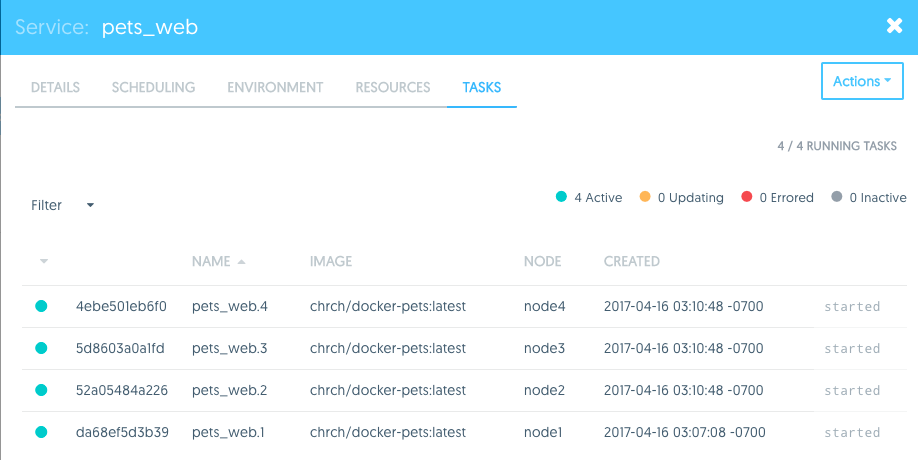 

Now go back to the application `<public-ip>:<published-port>` in your browser. Click Server Another Pet a few times to see the page get reloaded. You should see the Container ID changing between three different values. UCP is automatically load balancing your requests between the three containers in the `pets_web` service.

### <a name="task1.3"></a>Task 1.3: Deploying the Visualizer App

Now we are going to deploy a second service along with our Docker Pets application. It's called the Visualizer and it visually shows how containers are scheduled across a UCP cluster.

Now we are going to update the `pets` stack with the following compose file. We have added a couple things to this compose file.

```
version: '3.1'
services:
    web:
        image: chrch/docker-pets:latest
        deploy:
            replicas: 4
        ports:
            - 5000
        healthcheck:
            interval: 10s
            timeout: 2s
            retries: 3   
            
    visualizer:
        image: manomarks/visualizer
        ports:
            - 8080
        deploy:
            placement:
                constraints: [node.role == manager]
        volumes:
            - /var/run/docker.sock:/var/run/docker.sock
```

- `replicas: 4` defines how many identical copies of a service container we want UCP to schedule. 
- `visualizer:` is a second service we are going deploy as a part of this stack. 
- `constraints: [node.role == manager]` is a scheduling requirement we are applying so that the `visualizer` is only scheduled on the manager node.
- `- /var/run/docker.sock:/var/run/docker.sock` is a host-mounted volume we are mounting inside our container. This volume is being used so that the `visualizer` can communicate directly with the local docker engine.

1. Go to Resources / Stacks & Applications / Deploy. Paste the above compose file text into the box under Application Definition with the title `pets`. 

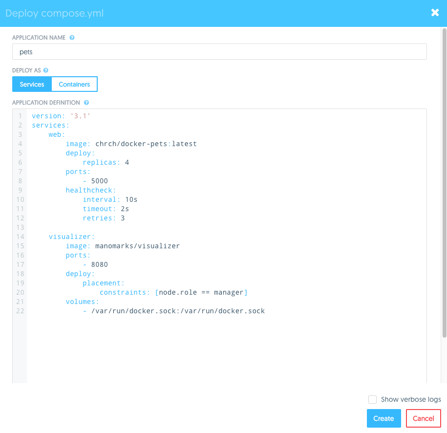 

You should see the following output:

```
Updating service pets_web (id: vyp6gx092d1o6z7t2wy996i7u)
Creating service pets_visualizer
```

The `pets_visualizer` service is created and our existing `pets_web` service is updated. Because no `pets_web` parameters were changed in this compose file, there are no actions done to the `web` containers.

Go to the `<external-ip>:<port>` that is listed on the page of the 	`pets_visualizer` service in your browser window. This shows you the nodes of your UCP cluster and where containers are scheduled. You should see that the `pets_web` container is evenly distributed across your nodes.

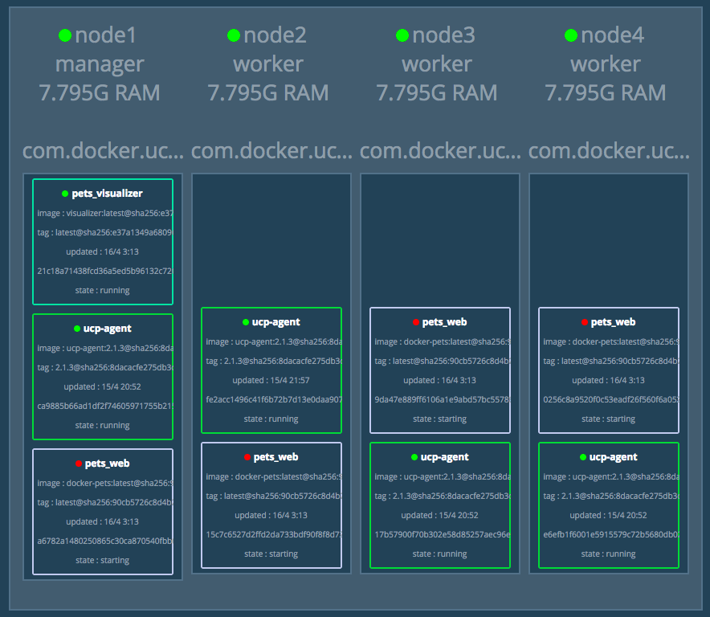

Finally, decommission this pets stack in the UCP GUI by clicking on pets / Actions / Remove Stack. Confirm the removal. You have just removed all of the containers and also the networks that were created when the stack was first deployed.

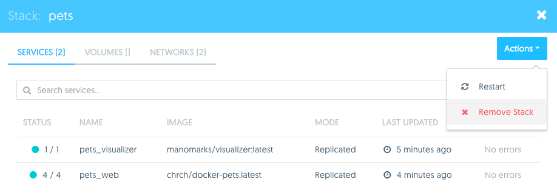 

## <a name="task2"></a>Task 2: Deploying a Multi-Service Application with Secrets

In this task we are going to add another service to the stack. Up to this point the Docker Pets application was a set of stateless web servers. Now we are going to add a persistent backend that will enhance the functionality of the application. We will use `consul` as a redundant backend which will store persistent data for our app, distributed across a set of nodes.

The resulting application will have 4 `web` frontend containers and 4 `db` consul containers. A backend network will be deployed for secure communication between `web` and `db`. The app is exposing HTTP endpoints for different services on ports `5000` and `7000`. UCP will publish these ports on each node in the UCP cluster. Application traffic to any of the external ports will get load balanced to healthy containers.


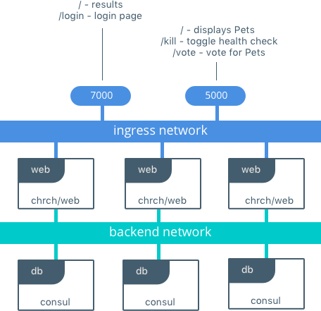 

### <a name="task2.1"></a>Task 2.1: Deploying a Stateful Service 

In this step we will deploy a new compose file that adds functionality on top of the previous compose files.

```
version: '3.1'
services:
    web:
        image: chrch/docker-pets:latest
        deploy:
            replicas: 4
        ports:
            - 5000
            - 7000
        healthcheck:
            interval: 10s
            timeout: 2s
            retries: 3
        environment:
            DB: 'db'
        networks:
        	  - backend
            
    db:
        image: consul:0.7.2
        command: agent -server -ui -client=0.0.0.0 -bootstrap-expect=3 -retry-join=db -retry-join=db -retry-join=db -retry-interval 5s
        deploy:
            replicas: 4
        ports:
            - 8500 
        environment:
            CONSUL_BIND_INTERFACE: 'eth2'
            CONSUL_LOCAL_CONFIG: '{"skip_leave_on_interrupt": true}'
        networks: 
            - backend
            
    visualizer:
        image: manomarks/visualizer
        ports:
            - 8080
        deploy:
            placement:
                constraints: [node.role == manager]
        volumes:
            - /var/run/docker.sock:/var/run/docker.sock
    
networks:
	 backend:
```

- `- 7000` is exposing a second port on our application. This port will serve traffic to administrate the app.
- `environment:` defines environment variables that are set inside the container. In this compose file we are setting `DB=db`. Our backend service is named `db` so we are passing in the service name to the front end `web` service. During operations, built-in Docker DNS will resolve the service name to the IPs of the service's containers.
- `image: consul:0.7.2` is the image and version for our backend data persistence store. We are deploying 3 replicas for a highly available backend.
- `command:` is passing a specific command line argument to the consul image.
- `networks: backend:` defines an overlay network that both `web` and `db` will connect to to communicate.

Deploy the `pets` stack again with the above compose file. 

Once all the service tasks are up go to the `web` service externally published `<ip>:<port>` that maps to the internal port `5000`. The Docker Pets app is written to take advantage of the stateful backend. Now it gives you the capability to cast a vote for your favorite pet. The vote will be stored by the `db` service along with the number of visits to the application.

Submit your name and vote to the app.

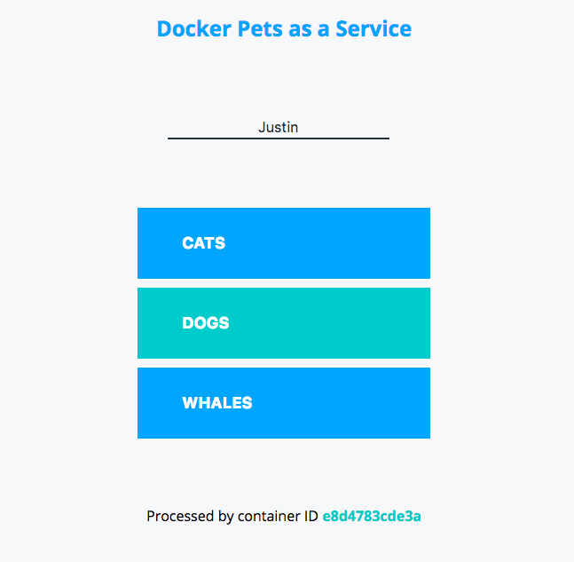 

After you cast your vote you will get redirected back to the pets landing page. 

Refresh the page a few times with Server Another Pet. You will see the page views climb while you get served across all three `web` containers.

Now go to the `web` service externally published `<ip>:<port>` that maps to the internal port `7000`. This page totals the number of votes that are held in the `db` backend.

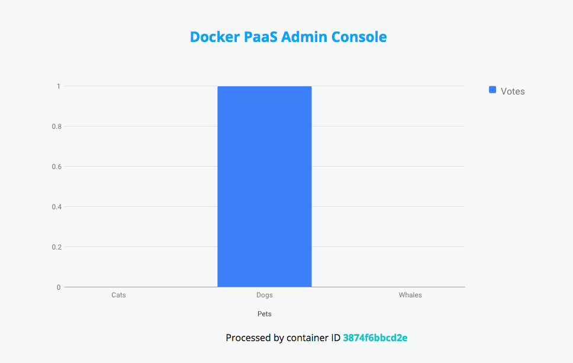 

If you go to the `visualizer` service in your browser you will now see that a redundant Consul KV store is deployed on the Swarm. It's storing the votes for the application.

### <a name="task2.2"></a>Task 2.2: Configuring Application Secrets

Secrets are any data that an application uses that is sensitive in nature. Secrets can be PKI certificates, passwords, or even config files. UCP handles secrets as a special class of data. Docker secrets are encrypted them at rest, sent to containers through TLS, and are mounted inside containers in a memory-only file that is never stored on disk. 

Before we can configure our compose file to use a secret, we have to create the secret so it can be stored in the encrypted UCP key-value store. 

1. In the UCP GUI go to Resources / Secrets / +Create Secret. Name your secret `admin_password`. Enter the secret password of your choice and click Create.


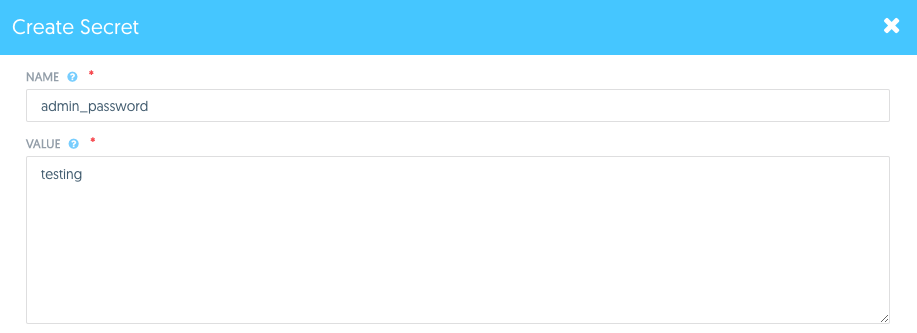 

This secret will now be stored encrypted in the UCP data store. When applications request access to it, the secret will be sent encrypted to the container and mounted in a memory-only file on the host.

2. Update the `pets` stack with the following compose file.

```
version: '3.1'
services:
    web:
        image: chrch/docker-pets:latest
        deploy:
            replicas: 4
        ports:
            - 5000
            - 7000
        healthcheck:
            interval: 10s
            timeout: 2s
            retries: 3
        environment:
            DB: 'db'
            ADMIN_PASSWORD_FILE: '/run/secrets/admin_password'
        networks:
        	  - backend
        secrets:
            - admin_password
            
    db:
        image: consul:0.7.2
        command: agent -server -ui -client=0.0.0.0 -bootstrap-expect=3 -retry-join=db -retry-join=db -retry-join=db -retry-interval 5s
        deploy:
            replicas: 4
        ports:
            - 8500 
        environment:
            CONSUL_BIND_INTERFACE: 'eth2'
            CONSUL_LOCAL_CONFIG: '{"skip_leave_on_interrupt": true}'
        networks: 
            - backend

            
    visualizer:
        image: manomarks/visualizer
        ports:
            - 8080
        deploy:
            placement:
                constraints: [node.role == manager]
        volumes:
            - /var/run/docker.sock:/var/run/docker.sock
    
networks:
	 backend:

secrets:
    admin_password:
        external: true
```

We have made two additions to this compose file:

- `ADMIN_PASSWORD_FILE:` is an environment variable that tells the `web` service that the secret will be stored at the location `/run/secrets/admin_password`
- `secrets: admin_password` references the secret that we created in UCP. UCP will send the secret to the `web` containers wherever they are scheduled.

3. Now go to the `<host-ip>:<port>` on the `pets_web` service that is mapped to the internal port `7000`. This is the administrator consul that displays the votes. It should be protected by a password now. Use the secret you entered as the `admin_password`.

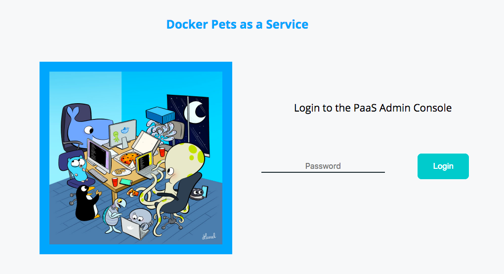

### <a name="task2.3"></a>Task 2.3: Upgrading with a Rolling Update

A rolling update is a deployment method to slowly and incrementally update a series of containers with a new version in a way that does not cause downtime for the entire application. One by one, UCP will update containers and check the application health for any issues. If the deployment begins to fail in any way, a rollback can be applied to return the app to the last known working configuration.

In the following steps we will update the `pets_web` service with a new image version. We will use a purposely broken image to simulate a bad deployment. 

Click on the `pets_web` service. On the Details page change the image to  `chrch/docker-pets:broken`. Make sure to click the green check so that the change is captured.

On the Scheduling page update the following values:
   - Update Parallelism `1`
   - Update Delay `5`
   - Failure Action `pause`
   - Max Failure Ratio `0.2` (%)

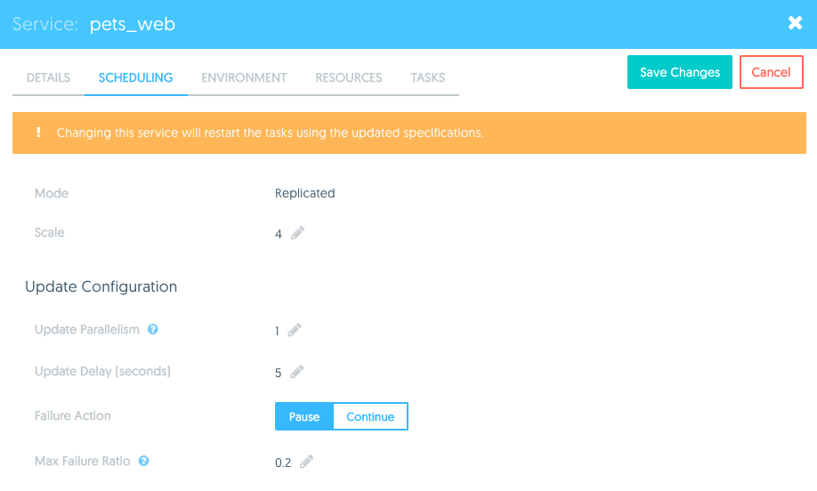

These values mean that during a rolling update, containers will be updated `1` container at a time `5` seconds apart. If more than `20%` of the new containers fail their health checks then UCP will `pause` the rollout and wait for administrator action.

3. The changes you made are now staged but have not yet been applied. Click Save Changes. This will start the rolling update.

Now view the Visualizer app in your browser. You will see that the `chrch/docker-pets:broken` image is rolled out to a single container but it fails to pass it's health check. The second `chrch/docker-pets:broken` container will start failing afterwards which will trigger the rolling update to pause.

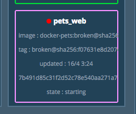

In UCP, click on the `pets_web` service. You will see the status of the update is now paused because of a failed health check.

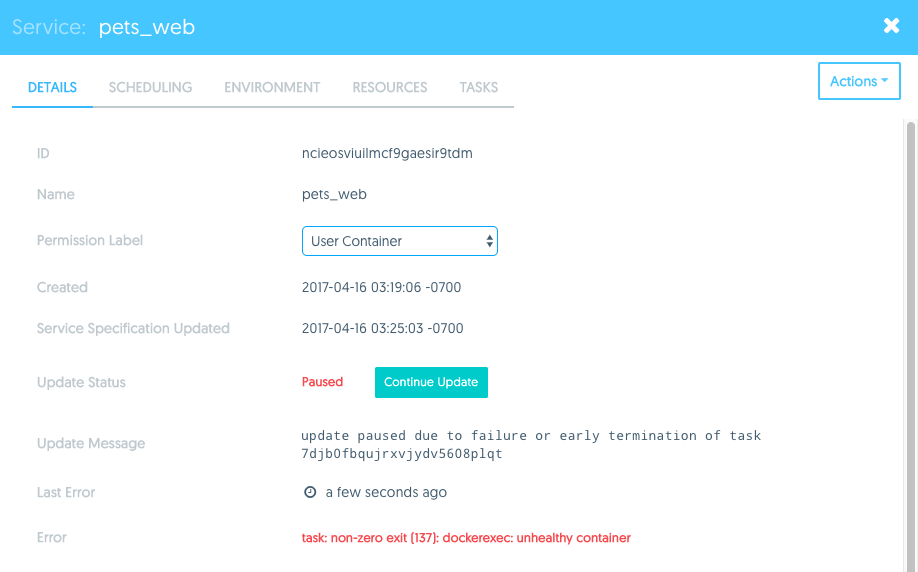

In the Details page of `pets_web` click Actions / Rollback. This will automatically rollback the `pets_web` service to the last working image.
 
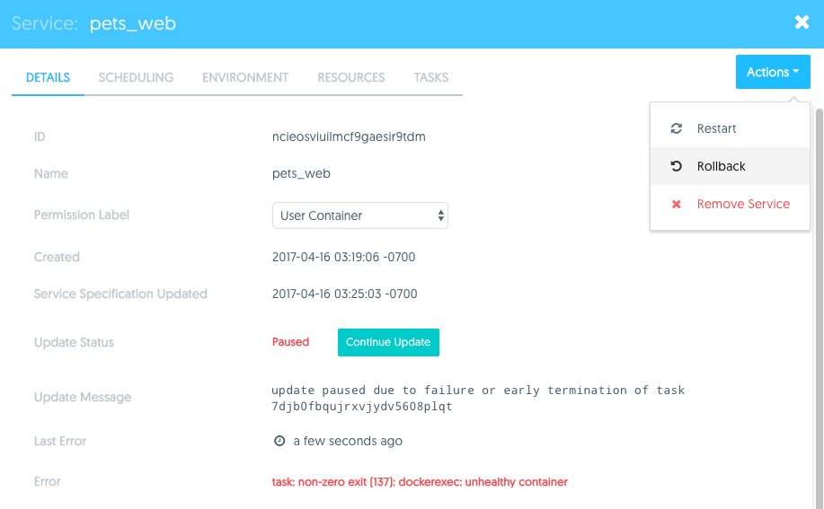

Repeat step 1 but this time use the image `chrch/docker-pets:2.0`.

Repeat step 2 with the same values and click Save Changes.

Observe a successful rolling update in the Visualizer. You will start to see each container being updated with the new image and in good health. Now go to the `<host-ip>:<port>` that corresponds to the internal port `5000`. After a couple refreshes you should see that some of the containers have already updated.

## <a name="task3"></a>Task 3: Securing Applications with DTR

In this task you will build your application from a Dockerfile and push your image to the Docker Trusted Registry (DTR). DTR will scan your image for vulnerabilities so they can be fixed before your application is deployed. This helps you build more secure apps!

### <a name="task3.1"></a>Task 3.1: Example Application

Clone your application from the [GitHub repo](https://github.com/mark-church/docker-pets) with `git`. Go to the `/web` directory. This is the directory that holds the source for our application.

```
~$ git clone https://github.com/mark-church/docker-pets
~$ cd docker-pets/web
```

Inspect the directory.

```
~/docker-pets/web $ ls
admin.py  app.py  Dockerfile  static  templates
```

- `admin.py` & `app.py` are the source code files for our Python application.
- `/static` & `/templates` hold the static content, such as pictures and HTML, for our app.
- `Dockerfile` is the configuration file we will use to build our app.

Inspect contents of the `Dockerfile` for the web frontend image.

```
~/docker-pets/web $ cat Dockerfile
FROM alpine:3.3

RUN apk --no-cache add py-pip libpq python-dev curl

RUN pip install flask==0.10.1 python-consul

ADD / /app

WORKDIR /app

HEALTHCHECK CMD curl --fail http://localhost:5000/health || exit 1

CMD python app.py & python admin.py
```

Our Dockerfile includes a couple notable lines:

- `FROM alpine:3.3` indicates that our Application is based off of an Alpine OS base image.
- `RUN apk` & `RUN pip` lines install software packages on top of the base OS that our applications needs.
- `ADD / /app` adds the application code into the image.

### <a name="task3.2"></a>Task 3.2: Build the Application Image

1. Build the image from the Dockerfile. You are going to specify an image tag `docker-pets` that you will reference this image by later. The `.` in the command indicates that you are building from the current directory. Docker will automatically build off of any file in the directory named `Dockerfile`.

```
~/docker-pets/web $ docker build -t docker-pets .
Sending build context to Docker daemon 26.55 MB
Step 1/7 : FROM alpine:3.4
 ---> baa5d63471ea
Step 2/7 : RUN apk --no-cache add py-pip libpq python-dev curl
 ---> Running in 382419b97267
fetch http://dl-cdn.alpinelinux.org/alpine/v3.4/main/x86_64/APKINDEX.tar.gz
...
...
...
```

It should not take more than a minute to build the image.

You should now see that the image exists locally on your Docker engine by running `docker images`.

```
~/docker-pets/web $ docker images
REPOSITORY          TAG                 IMAGE ID            CREATED             SIZE
docker-pets         latest              f0b92696c13f        3 minutes ago       94.9 MB
```

### <a name="task3.3"></a>Task 3.3: Creating a Repo

DTR has already been set up for you so you will log in to it and use it.

Log in to DTR. Before the lab you should have been assigned a cluster and a username. Use these when logging in.

Go to `https://pod1-dtr.boothdemo.com/` or `https://pod2-dtr.boothdemo.com/` and login with your given username and password. You should see the DTR home screen.

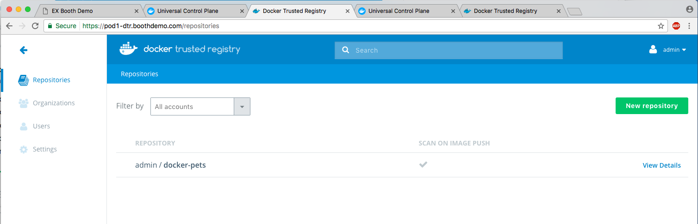 

Before you can push an image to DTR you must create a repository. Click on Repositories / New repository. Fill it with the following values:

- Account: select your username
- Repository Name: `docker-pets`
- Description: Write any description
- Visibility: Private
- Scan on Push: On

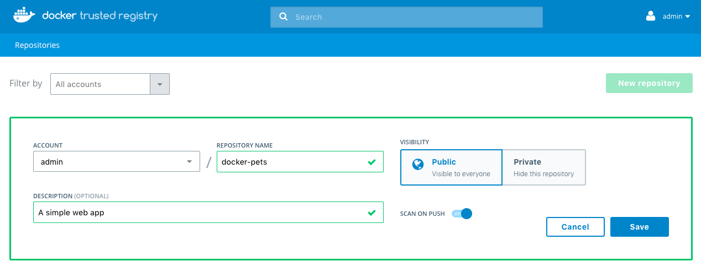 

Click Save. If you click on the `admin/docker-pets` repo you'll see that it is empty as we have not pushed any images to it yet.


### <a name="task3.4"></a>Task 3.4: Pushing to the Docker Trusted Registry

Next we will push our local image to DTR. First we will need to authenticate with DTR so that our local engine trusts it.

Log in to DTR with your username.

```
~/docker-pets $ docker login pod1-dtr.boothdemo.com
Username: admin
Password:
Login Succeeded
```

Tag the image with the URL of your DTR cluster and with the image tag `1.0`.

```
~/docker-pets $ docker tag docker-pets pod1-dtr.boothdemo.com/admin/docker-pets:1.0
```

Now push your image to DTR.

```
~/docker-pets $ docker push docker tag docker-pets pod1-dtr.boothdemo.com/admin/docker-pets:1.0
The push refers to a repository [pod1-dtr.boothdemo.com/admin/docker-pets]
273eb8eab1c9: Pushed
7d68ed329d0d: Pushed
02c1439e0fdc: Pushed
9f8566ee5135: Pushed
1.0: digest: sha256:809c6f80331b9d03cb099b43364b7801826f78ab36b26f00ea83988fbefb6cac size: 1163
```

Go to the DTR GUI and click on your `docker-pets` repo. The image vulnerability scan should have started already and DTR will display the status of the scan. Once the scan is complete, DTR will display the number of vulnerabilities found. For the `docker-pets` image a critical vulnerability was found.

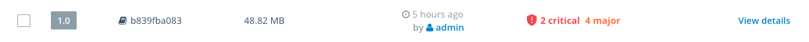 

> You may need to refresh the page to show the status of a scan

Click on View details. The Layers tab shows the results of the scan. The scan is able to identify the libraries that are installed as a part of each layer.

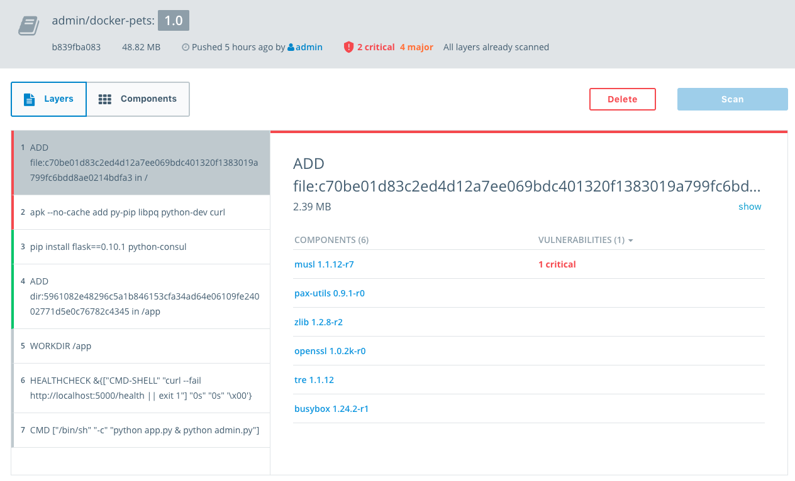 

Click on Components. The Components tab lists out all of the libraries in the image, arranged from highest to least severity. The CVE is shown in addition to the usage license of the component. If you click on the CVE link it will take you to the official description of the vulnerability.

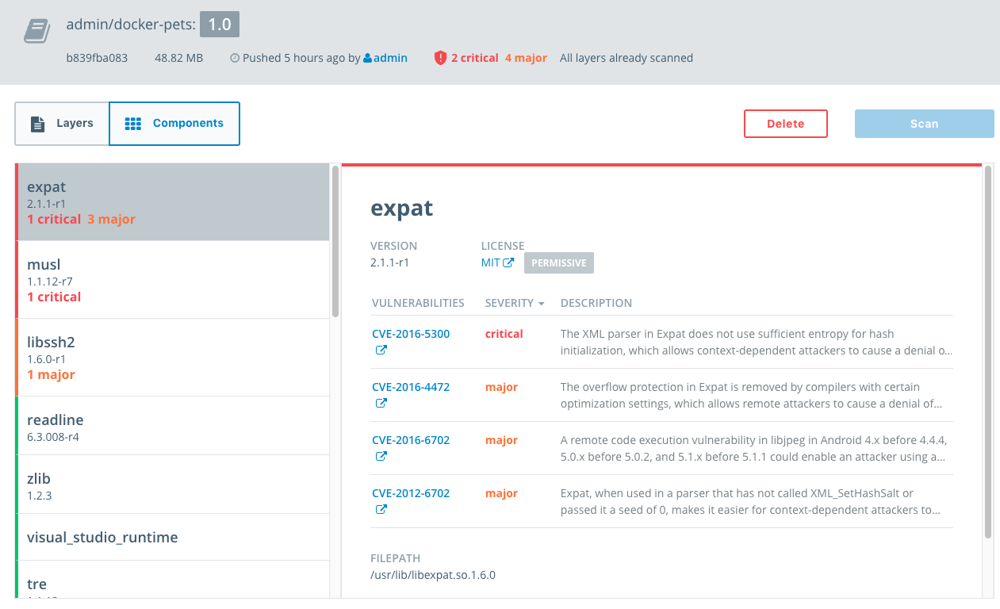

### <a name="task3.5"></a>Task 3.5: Rebuild the Image (Fix, Rebuild, and Scan)

We have built and pushed our application to DTR. DTR image scanning identified a vulnerability and now we are going to remediate the vulnerability and push the image again.

We identified that our application has the known vulnerability `CVE-2016-8859`. We can see in the Layers tab that the affected package `musl 1.1.14-r14` is located in the top layer of our image. This is the base layer that was specified in the Dockerfile as `FROM alpine:3.4`. To remediate this we are going to use a more recent version of the `alpine` image, one that has this vulnerability fixed.

1. Go to the `~/docker-pets/web` directory and edit the Dockerfile.

```
~/docker-pets/web $ vi Dockerfile
```

2. Change the top line `FROM alpine:3.3` to `FROM alpine:3.5`. `alpine:3.5` is  newer version of the base OS that has this vulnerability fixed.

3. Rebuild the image. 

```
~/docker-pets/web $ docker build -t docker-pets .

```

4. Tag the image as the `2.0` and also with the DTR URL.

```
~/docker-pets $ docker tag docker-pets docker tag docker-pets pod1-dtr.boothdemo.com/admin/docker-pets:2.0
```

Push the new image to DTR.

```
~/docker-pets $ docker push pod2-dtr.boothdemo.com/admin/docker-pets:2.0
```

Go to the DTR UI and wait for the scan to complete. Once the scan has completed DTR will report that the vulnerability no longer exists in this image. The image is now ready for use by the rest of your team!

> You may need to refresh the page to show the status of a scan

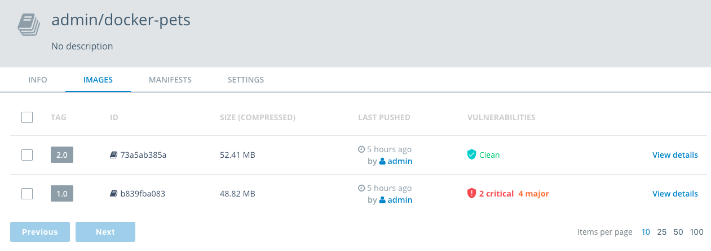 


Congratulations! You just built an application, discovered a security vulnerability, and patched it in just a few easy steps.
